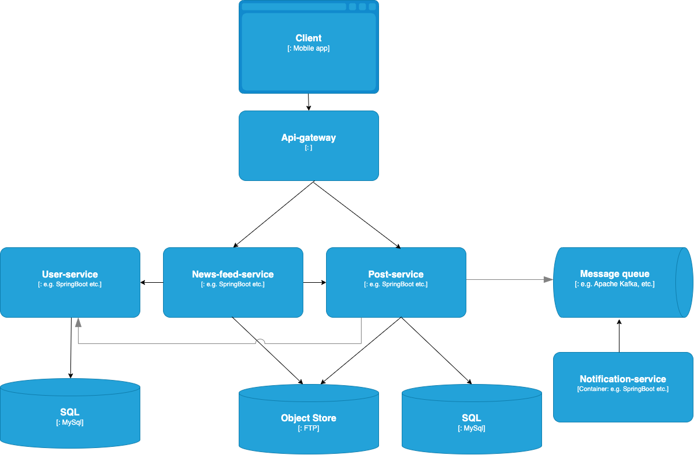

# Design Instagram

## Use cases and constraints

### Use cases

#### Scope the problem to handle only the following use cases

We analyse just news feed that contains video and photos. 

We interested only in likes and comments functionality

* **User** creates post with video or photo
  * **Service** sends notifications to followers
* **User** views news feed
  * **System** determines the order of posts based on user preferences
* **User** leaves a comment to post
  *  **Service** sends notifications to creator of the post
* **User** likes a post 
  *  **Service** sends notifications to creator of the post
* **User** views the comments of the post

### Constraints and assumptions

General

* 500 million active users per day
* 95 million photos and videos posts per day
* 500 million comments per day
* 4.2 billion likes per day
* Traffic is not evenly distributed

News feed

* The system should be compatible with a wide range of devices and work well with varying internet bandwidths
* News feed should be loaded quickly and smoothly
* Instagram is read-heavy system
    * Optimize for fast news feed load

Making a post
* Eventual consistency is ok
  * it is acceptable that a new post will not appear in the News feed immediately
  * it is acceptable that like or comment will not be displayed immediately
* Instagram is write-heavy system
  * Optimize for many concurrent writes for likes and comments
  
## High level design - Approach 1

## SPOF and Bottlenecks
* News-Feed-Service generates feed in real-time
* making likes and comments produces too many writes to DB
* big media files are transferring through BE services
* slow loading time of original size images and videos
* a lot of reads and writes requests in general
* single example of each instance is SPOF

## High level design - Improved Approach 2

## Design core components

### Use case: User posts
* The **Client** sends Post creation request to the **Api Gateway** through **Load Balancer**
* The **Api Gateway** forwards the request to the **Post-Service** server
* The **Post-Service** 
  * Stores the media file in **Object Store**
  * Stores the Post metadata and media file path in the **SQL database**
  * Sends event to **Message Broker**
* The **Fan out Service** server pulls from the **Message broker**
  * Gets the user followers stored by **User Service** in the **Distributed Cache**
  * Stores the post in the *home news feed of the user's followers* in a **Distributed Cache**
  * Contacts the **Notification Service** to send out push notifications to followers:
    * Uses a **Queue** (not pictured) to asynchronously send out notifications

### Use case: User views the home News Feed

* The **Client** requests home News Feed from to the **Api Gateway** through **Load Balancer**
* The **Api Gateway** forwards the request to the **News-feed-service** server
* The **News-feed-service** does the following:
  * Gets the news feed data stored in the **Distributed Cache**, containing post ids and user ids
  * Gets User preferences stored by **User Service** in **Distributed Cache**
  * Filters and sorts news feed posts based on user preferences
  * Queries the **Post-Service** to obtain additional info about the posts ids such as Post data and Post likes
  * Queries the **User-Service** to obtain additional info about the user ids
* The **Client** loads media files from the **Image CDN**
  * **Image CDN** loads files from its cached or **Object Store**
  * **Image CDN** optimizes images for different devices

### Use case: User leaves a comment to the Post

* The **Client**  sends Create Comment request to the **Api Gateway** through **Load Balancer**
* The **Api Gateway** forwards the request to the **Post-Service** server
* The **Post-Service** server 
  * places a job on a **Queue**
  * asynchronously pulls from the **Queue** and store comments to **SQL DB** by batches
  * contacts the **Notification Service** to send out push notifications to post creator

### Use case: User views the comments of the Post
* The **Client** sends paginated *Get Comments* request to the **Api Gateway**
* The **Api Gateway** forwards the request to the **Post-Service** server
* The **Post-Service** 
  * checks the **Memory Cache** for the comments by post-id 
  * if the comments are in the Memory Cache, returns the cached result
  * else
    * if the comments are in the SQL Database, fetches the result
    * updates the Memory Cache with the contents

### Use case: Like the Post - similar to Comments use case

